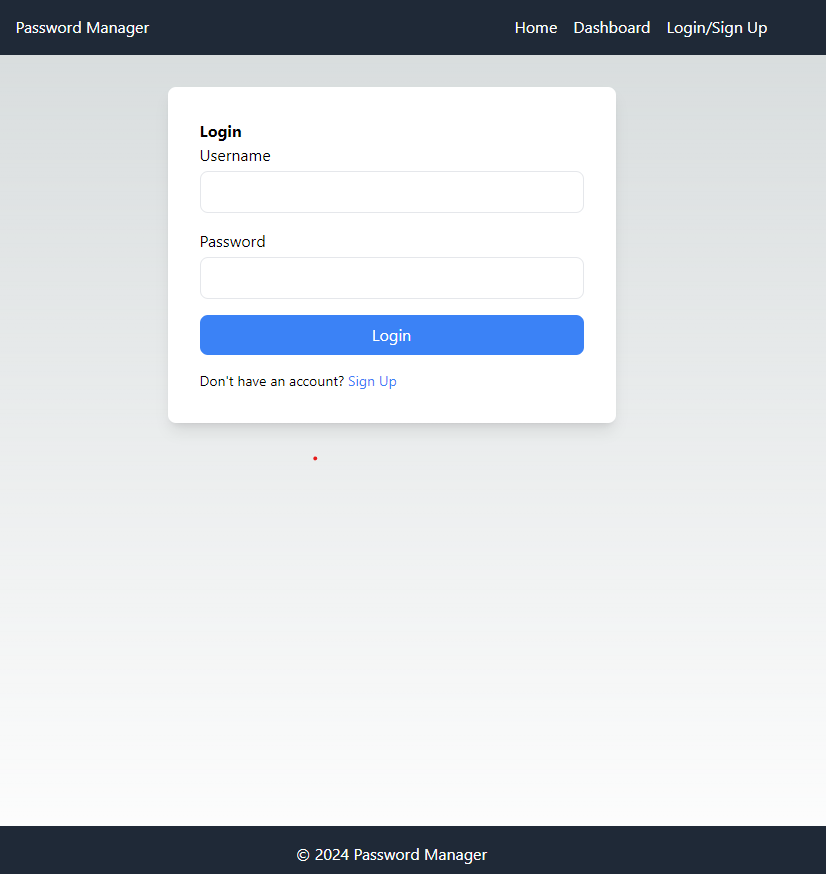
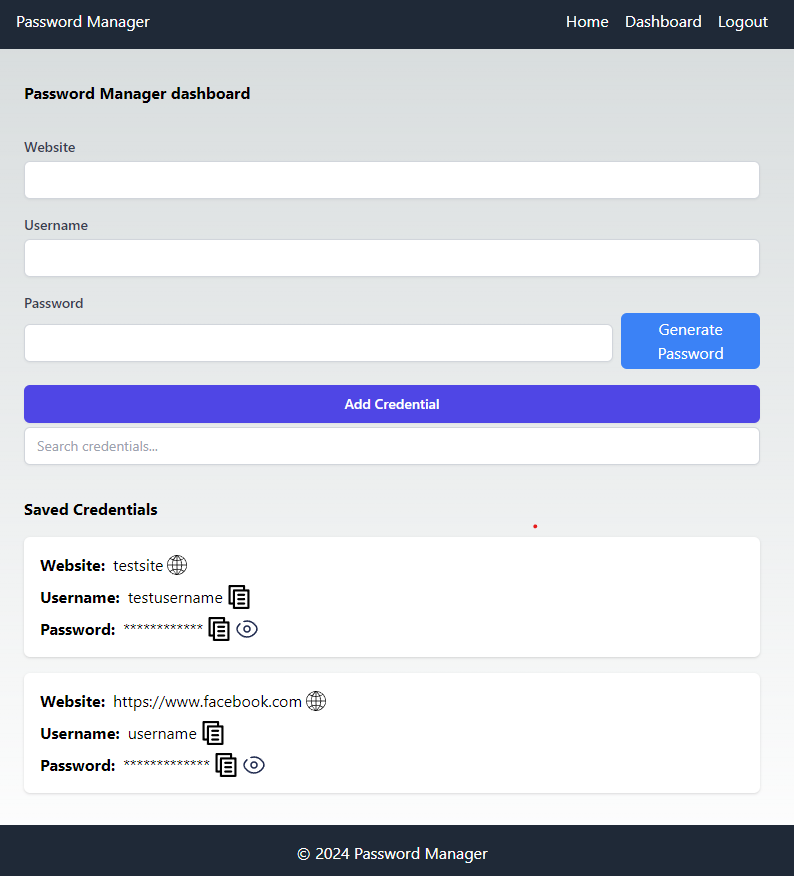

# Password Manager

## Description

This is an online password manager for personal usage.
You can create an account for yourself and keep track of your credentials for different sites.



You can add the site which thease credentials are for, the username and the passowr you made up or generated. You can see all your saved credentials and search for a specific one.



The frontend is made using Next.js and Typescript and Tailwind CSS.
Backend is made using Pythons Flask library. The database is made with SQLite.
Front and backend are also build inside of a container using Docker.

## Features

- Creation of an account
- Loggin in to your account
- Save credentials for a site you choose.
- Generate a safe password for that site.
- See and search for you credentials

## Installation

```cmd
git clone https://github.com/SanteriMertakorpi/Password-Manager.git
```

## Usage

First install Docker and the run

```cmd
docker-compose up --build
```

Now the frontend shoudl be running on your ```http://localhost:3000``` and backend at ```http://localhost:5000```

## License

This project is under MIT License.
